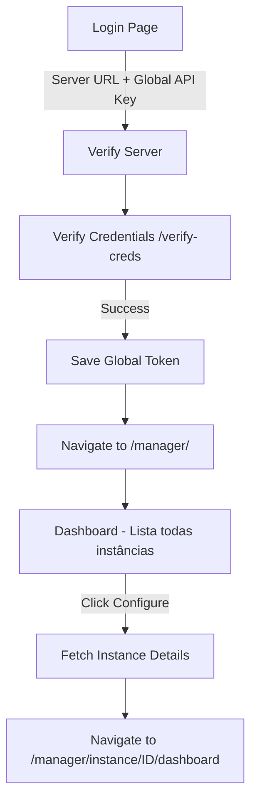
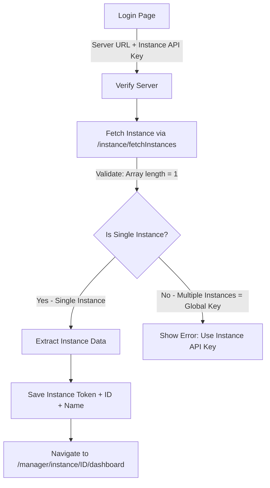
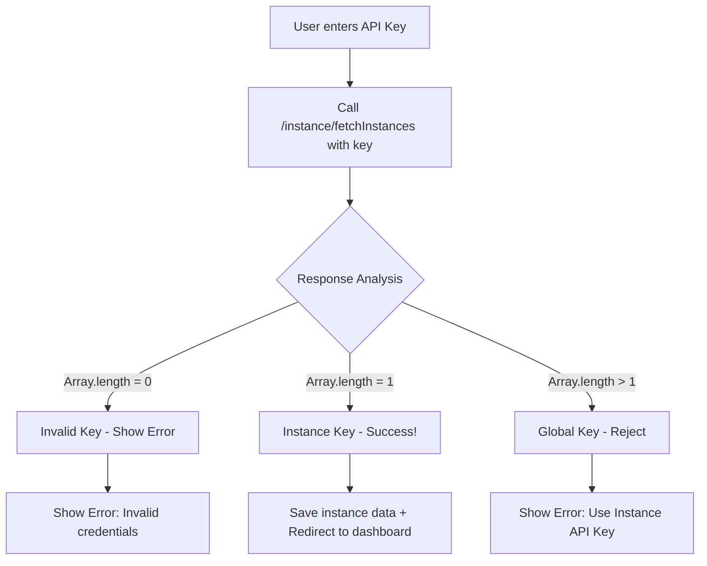

# Plano de Implementação: Evolution Manager - Single Instance Mode

## 📋 Visão Geral

Transformar o Evolution Manager de um gerenciador multi-instância para um gerenciador single-instance, onde:
- Login aceita **APENAS** Instance API Key
- Rejeita tentativas de login com Global API Key
- Redireciona direto para dashboard da instância após login
- Mantém Dashboard multi-instância no código (mas sem uso)

---

## 🔄 Fluxo Atual vs Novo Fluxo

### **Fluxo ATUAL**


### **Fluxo NOVO**


---

## 🎯 Componentes a Modificar

### 1. **Login Page** (`src/pages/Login/index.tsx`)

**Mudanças:**
- Manter campo "Server URL"
- Renomear label "API Key" para "Instance API Key"
- Modificar função `handleLogin`:
  - Chamar `/instance/fetchInstances` em vez de `/verify-creds`
  - Validar resposta (deve retornar array com 1 item)
  - Rejeitar se retornar múltiplas instâncias (= Global Key)
  - Extrair: `id`, `name`, `token` da instância
  - Redirecionar para `/manager/instance/{instanceId}/dashboard`

**Pseudo-código da nova lógica:**
```typescript
const handleLogin = async (data) => {
  // 1. Verificar servidor
  const server = await verifyServer({ url: data.serverUrl });
  if (!server) return showError("Invalid Server");

  // 2. Tentar buscar instâncias com a key fornecida
  const instances = await fetchInstancesWithKey({
    url: data.serverUrl,
    apikey: data.apiKey
  });

  // 3. Validar resposta
  if (!instances || instances.length === 0) {
    return showError("Invalid API Key");
  }

  if (instances.length > 1) {
    return showError("Global API Key detected. Please use Instance API Key.");
  }

  // 4. Instância única válida
  const instance = instances[0];
  
  // 5. Salvar dados da instância
  saveToken({
    url: data.serverUrl,
    token: instance.token,
    instanceId: instance.id,
    instanceName: instance.name,
    version: server.version,
    clientName: server.clientName
  });

  // 6. Redirecionar para dashboard da instância
  navigate(`/manager/instance/${instance.id}/dashboard`);
};
```

---

### 2. **Authentication Function** (`src/lib/queries/auth/verifyCreds.ts`)

**Nova função:** `verifyInstanceKey.ts`

```typescript
interface VerifyInstanceKeyParams {
  url: string;
  apikey: string;
}

interface InstanceValidationResponse {
  isValid: boolean;
  isGlobalKey: boolean;
  instance?: {
    id: string;
    name: string;
    token: string;
    connectionStatus: string;
  };
  error?: string;
}

export const verifyInstanceKey = async ({ 
  url, 
  apikey 
}: VerifyInstanceKeyParams): Promise<InstanceValidationResponse> => {
  try {
    const { data } = await axios.get(
      `${url}/instance/fetchInstances`,
      { headers: { apikey } }
    );

    // Validar resposta
    if (!data || !Array.isArray(data)) {
      return {
        isValid: false,
        isGlobalKey: false,
        error: "Invalid API response"
      };
    }

    // Múltiplas instâncias = Global Key
    if (data.length > 1) {
      return {
        isValid: false,
        isGlobalKey: true,
        error: "Global API Key detected"
      };
    }

    // Nenhuma instância = Key inválida
    if (data.length === 0) {
      return {
        isValid: false,
        isGlobalKey: false,
        error: "No instance found with this key"
      };
    }

    // Instância única = Sucesso!
    const instance = data[0];
    return {
      isValid: true,
      isGlobalKey: false,
      instance: {
        id: instance.id,
        name: instance.name,
        token: instance.token,
        connectionStatus: instance.connectionStatus
      }
    };

  } catch (error) {
    return {
      isValid: false,
      isGlobalKey: false,
      error: "Authentication failed"
    };
  }
};
```

---

### 3. **Token Storage** (`src/lib/queries/token.ts`)

**Mudanças:**
- Os enums `INSTANCE_ID` e `INSTANCE_NAME` já existem
- Garantir que `saveToken()` salva instanceId e instanceName
- Atualizar `logout()` para limpar instanceId e instanceName

**Atualização necessária:**
```typescript
// Adicionar ao SaveCredentialsParams
interface SaveCredentialsParams {
  url?: string;
  token?: string;
  instanceId?: string;
  instanceName?: string;
  version?: string;
  // ... outros campos
}

// Atualizar saveToken
export const saveToken = async (params: SaveCredentialsParams) => {
  // ... código existente ...
  if (params.instanceId) localStorage.setItem(TOKEN_ID.INSTANCE_ID, params.instanceId);
  if (params.instanceName) localStorage.setItem(TOKEN_ID.INSTANCE_NAME, params.instanceName);
};

// Atualizar logout
export const logout = () => {
  // ... código existente ...
  localStorage.removeItem(TOKEN_ID.INSTANCE_ID);
  localStorage.removeItem(TOKEN_ID.INSTANCE_NAME);
};
```

---

### 4. **API Configuration** (`src/lib/queries/api.ts`)

**Análise:**
- Já existe `api` (usa INSTANCE_TOKEN)
- Já existe `apiGlobal` (usa TOKEN global)
- **DECISÃO:** Como agora usamos apenas Instance Token, precisamos garantir que:
  - `api` continue usando `INSTANCE_TOKEN`
  - Salvar o token da instância em `TOKEN_ID.INSTANCE_TOKEN`

**Mudança necessária no Login:**
```typescript
// Ao salvar após login bem-sucedido
saveToken({
  url: data.serverUrl,
  token: instance.token,  // ← Salvar como INSTANCE_TOKEN, não como TOKEN
  instanceId: instance.id,
  instanceName: instance.name,
  // ...
});
```

**Atualizar saveToken para salvar como INSTANCE_TOKEN:**
```typescript
export const saveToken = async (params: SaveCredentialsParams) => {
  // ...
  if (params.token) {
    localStorage.setItem(TOKEN_ID.INSTANCE_TOKEN, params.token);
  }
  // ...
};
```

---

### 5. **Protected Route** (`src/components/providers/protected-route.tsx`)

**Ler arquivo atual para entender:**
```typescript
// Precisamos ler este arquivo para ver como funciona
```

**Mudanças esperadas:**
- Verificar se `INSTANCE_TOKEN`, `INSTANCE_ID` e `INSTANCE_NAME` existem
- Redirecionar para login se não existirem
- Opcional: Redirecionar `/manager/` para `/manager/instance/{instanceId}/dashboard`

---

### 6. **Routing** (`src/routes/index.tsx`)

**Mudanças:**
- Manter rota `/manager/` no código (como solicitado)
- Adicionar redirect automático na `ProtectedRoute` ou no próprio componente Dashboard
- Alternativa: Modificar Dashboard para redirecionar automaticamente

```typescript
// Opção 1: Modificar Dashboard para redirecionar
function Dashboard() {
  const navigate = useNavigate();
  const instanceId = getToken(TOKEN_ID.INSTANCE_ID);
  
  useEffect(() => {
    if (instanceId) {
      navigate(`/manager/instance/${instanceId}/dashboard`);
    }
  }, [instanceId, navigate]);
  
  return null; // Ou loading...
}

// Opção 2: Criar ProtectedInstanceRoute que redireciona /manager/ automaticamente
```

---

### 7. **Translation Files**

**Arquivos a atualizar:**
- `src/translate/languages/pt-BR.json`
- `src/translate/languages/en-US.json`
- `src/translate/languages/es-ES.json`
- `src/translate/languages/fr-FR.json`

**Mudanças:**
```json
{
  "login": {
    "form": {
      "apiKey": "Instance API Key",
      "serverUrl": "Server URL"
    },
    "message": {
      "invalidCredentials": "Invalid Instance API Key",
      "globalKeyDetected": "Global API Key detected. Please use the Instance API Key.",
      "noInstanceFound": "No instance found with this API Key"
    }
  }
}
```

---

## 📊 Diagrama de Dados

### **Dados Salvos no LocalStorage**

**ANTES:**
```
apiUrl: "https://evolution-api.com"
token: "Redes147#@" (Global API Key)
version: "2.1.0"
clientName: "evolution_v2"
```

**DEPOIS:**
```
apiUrl: "https://evolution-api.com"
instanceToken: "8C55DEE95878-4C99-B866-30C3DD8C38EA" (Instance API Key)
instanceId: "90386073-fee6-480b-a13b-132c5c015d85"
instanceName: "numero_de_teste"
version: "2.1.0"
clientName: "evolution_v2"
```

---

## 🔐 Validação de API Key

### **Como Diferenciar Global vs Instance Key**



**Lógica de Validação:**
```typescript
if (instances.length === 0) {
  // Key inválida ou sem permissão
  return "Invalid API Key";
}

if (instances.length > 1) {
  // Global Key (retorna todas as instâncias)
  return "Global API Key detected. Please use Instance-specific API Key.";
}

if (instances.length === 1) {
  // Instance Key válida!
  const instance = instances[0];
  // Proceder com login
}
```

---

## 🧪 Casos de Teste

### **Teste 1: Login com Instance API Key válida**
```bash
# Request
GET /instance/fetchInstances
Headers: { apikey: "8C55DEE95878-4C99-B866-30C3DD8C38EA" }

# Expected Response
[{
  "id": "90386073-fee6-480b-a13b-132c5c015d85",
  "name": "numero_de_teste",
  "token": "8C55DEE95878-4C99-B866-30C3DD8C38EA",
  // ... outros campos
}]

# Expected Behavior
✅ Login bem-sucedido
✅ Redirecionar para /manager/instance/90386073-fee6-480b-a13b-132c5c015d85/dashboard
```

### **Teste 2: Login com Global API Key (deve ser rejeitado)**
```bash
# Request
GET /instance/fetchInstances
Headers: { apikey: "Redes147#@" }

# Expected Response
[{instance1}, {instance2}, {instance3}, ...] # Múltiplas instâncias

# Expected Behavior
❌ Login rejeitado
❌ Mostrar erro: "Global API Key detected. Please use Instance API Key."
```

### **Teste 3: Login com API Key inválida**
```bash
# Request
GET /instance/fetchInstances
Headers: { apikey: "invalid-key" }

# Expected Response
401 Unauthorized ou []

# Expected Behavior
❌ Login rejeitado
❌ Mostrar erro: "Invalid API Key"
```

---

## 📝 Checklist de Implementação

### Fase 1: Autenticação
- [ ] Criar `verifyInstanceKey.ts` com lógica de validação
- [ ] Atualizar `Login/index.tsx` para usar nova função
- [ ] Atualizar `token.ts` para salvar instanceId, instanceName, instanceToken
- [ ] Testar login com Instance API Key válida
- [ ] Testar rejeição de Global API Key
- [ ] Testar rejeição de API Key inválida

### Fase 2: Navegação e Rotas
- [ ] Atualizar redirect pós-login para `/manager/instance/{id}/dashboard`
- [ ] Modificar Dashboard para redirecionar automaticamente (ou usar ProtectedRoute)
- [ ] Verificar ProtectedRoute para validar tokens corretos
- [ ] Testar navegação completa após login

### Fase 3: API Configuration
- [ ] Verificar que todas as chamadas API usam `api` (com INSTANCE_TOKEN)
- [ ] Remover ou depreciar uso de `apiGlobal` se não for mais necessário
- [ ] Testar todas as funcionalidades de gerenciamento de instância

### Fase 4: Traduções
- [ ] Atualizar pt-BR.json
- [ ] Atualizar en-US.json
- [ ] Atualizar es-ES.json
- [ ] Atualizar fr-FR.json

### Fase 5: Testes Finais
- [ ] Teste completo: Login → Dashboard → Funcionalidades
- [ ] Teste de logout e re-login
- [ ] Verificar que Dashboard multi-instância não é acessado
- [ ] Verificar que todas as mensagens de erro aparecem corretamente

---

## 🚀 Arquivos a Modificar (Resumo)

1. ✏️ **src/pages/Login/index.tsx** - Nova lógica de autenticação
2. ✏️ **src/lib/queries/auth/verifyInstanceKey.ts** - NOVO arquivo
3. ✏️ **src/lib/queries/token.ts** - Atualizar saveToken e logout
4. ✏️ **src/lib/queries/api.ts** - Verificar uso correto de tokens
5. ✏️ **src/pages/Dashboard/index.tsx** - Adicionar redirect automático
6. ✏️ **src/components/providers/protected-route.tsx** - Validar instance tokens
7. ✏️ **src/translate/languages/*.json** - Atualizar traduções

---

## ⚠️ Notas Importantes

1. **Manter Compatibilidade:** Dashboard multi-instância permanece no código, apenas não é usado
2. **Segurança:** Instance API Key é menos privilegiada que Global Key
3. **UX:** Mensagens de erro devem ser claras sobre qual tipo de key usar
4. **Navegação:** Sempre redirecionar para instância específica após login
5. **Token Storage:** Usar `INSTANCE_TOKEN` em vez de `TOKEN` global

---

## 📚 Referências API

### Endpoint: `/instance/fetchInstances`
- **Com Global API Key:** Retorna array com todas as instâncias
- **Com Instance API Key:** Retorna array com apenas 1 instância
- **Com Key Inválida:** Retorna 401 ou array vazio

```typescript
// Exemplo de resposta com Instance API Key
[{
  "id": "90386073-fee6-480b-a13b-132c5c015d85",
  "name": "numero_de_teste",
  "connectionStatus": "connecting",
  "token": "8C55DEE95878-4C99-B866-30C3DD8C38EA",
  "ownerJid": "554591026739@s.whatsapp.net",
  "profileName": "Techify 6",
  // ... outros campos
}]
```

---

## ✅ Conclusão

Este plano transforma o Evolution Manager de multi-instância para single-instance, mantendo toda a estrutura de código existente mas modificando apenas o fluxo de autenticação e navegação inicial. O usuário terá uma experiência focada em gerenciar apenas a instância para qual possui a API Key.