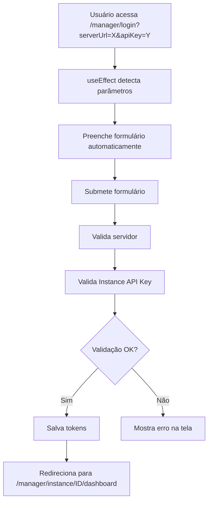

# Magic Link - Documentação

## 🔗 Funcionalidade Implementada

O Evolution Manager agora suporta **Magic Link** para auto-login através de parâmetros na URL.

---

## 📋 Como Funciona

Quando você acessa a página de login com os parâmetros `serverUrl` e `apiKey` na URL, o sistema:

1. ✅ Detecta automaticamente os parâmetros
2. ✅ Preenche os campos do formulário
3. ✅ Executa o login automaticamente
4. ✅ Valida a Instance API Key
5. ✅ Redireciona direto para o dashboard da instância

---

## 🌐 Formato do Magic Link

### Estrutura Básica
```
https://seu-servidor.com/manager/login?serverUrl={SERVER_URL}&apiKey={INSTANCE_API_KEY}
```

### Exemplo Real
```
https://evolution-teste.api-coolify.onlinecenter.com.br/manager/login?serverUrl=https://evolution-teste.api-coolify.onlinecenter.com.br&apiKey=INSTANCE_API_KEY
```

### Parâmetros Obrigatórios

| Parâmetro | Descrição | Exemplo |
|-----------|-----------|---------|
| `serverUrl` | URL completa do servidor Evolution API | `https://evolution-api.com` |
| `apiKey` | Instance API Key (não Global API Key) | `INSTANCE_API_KEY` |

---

## 💻 Exemplos de Uso

### 1. **Link Direto Simples**
```
https://seu-manager.com/manager/login?serverUrl=https://api.example.com&apiKey=ABC123-DEF456
```

### 2. **Link com URL Encoded (Recomendado)**
```javascript
const serverUrl = "https://evolution-api.com";
const apiKey = "INSTANCE_API_KEY";

const magicLink = `/manager/login?serverUrl=${encodeURIComponent(serverUrl)}&apiKey=${encodeURIComponent(apiKey)}`;

// Resultado:
// /manager/login?serverUrl=https%3A%2F%2Fevolution-api.com&apiKey=INSTANCE_API_KEY
```

### 3. **Gerar Magic Link Programaticamente**
```javascript
function generateMagicLink(serverUrl, instanceApiKey) {
  const baseUrl = window.location.origin;
  const params = new URLSearchParams({
    serverUrl: serverUrl,
    apiKey: instanceApiKey
  });
  
  return `${baseUrl}/manager/login?${params.toString()}`;
}

// Uso:
const link = generateMagicLink(
  "https://evolution-api.com",
  "INSTANCE_API_KEY"
);

console.log(link);
// https://your-domain.com/manager/login?serverUrl=https%3A%2F%2Fevolution-api.com&apiKey=INSTANCE_API_KEY
```

---

## 🔐 Validações Automáticas

O Magic Link passa pelas mesmas validações do login manual:

### ✅ **Validações que Ocorrem**
1. ✅ Verifica se o servidor é válido
2. ✅ Valida se a API Key é uma Instance API Key (não Global)
3. ✅ Confirma que retorna exatamente 1 instância
4. ✅ Extrai dados da instância (id, name, token)
5. ✅ Salva credenciais no localStorage
6. ✅ Redireciona para `/manager/instance/{instanceId}/dashboard`

### ❌ **Cenários de Erro**
- **Servidor inválido**: Mostra erro "Servidor inválido"
- **Global API Key**: Mostra erro "Global API Key detected. Please use Instance API Key."
- **API Key inválida**: Mostra erro "Invalid API Key"
- **Nenhuma instância encontrada**: Mostra erro "No instance found with this API Key"

---

## 🎯 Casos de Uso

### **Caso 1: Compartilhar Acesso Rápido**
Envie o Magic Link para um usuário que precisa acessar a instância:
```
https://manager.com/manager/login?serverUrl=https://api.com&apiKey=INSTANCE-KEY
```

### **Caso 2: Integração com Sistemas Externos**
Gere Magic Links dinamicamente em seu sistema para acesso direto:
```javascript
// No seu sistema backend ou frontend
const magicLink = createMagicLink(user.serverUrl, user.instanceApiKey);
// Enviar por email, SMS, etc.
```

### **Caso 3: QR Code para Acesso Móvel**
Gere um QR Code contendo o Magic Link:
```javascript
import QRCode from 'qrcode';

const magicLink = "https://manager.com/manager/login?serverUrl=...&apiKey=...";
QRCode.toDataURL(magicLink, (err, url) => {
  // Exibir QR Code
});
```

---

## 🛡️ Segurança

### ⚠️ **Importantes Considerações de Segurança**

1. **Instance API Keys são sensíveis**
   - Trate-as como senhas
   - Não as compartilhe em canais inseguros
   - Use HTTPS sempre

2. **Magic Links devem ser:**
   - Usados apenas em canais seguros (email criptografado, sistemas internos)
   - Considerados como credenciais temporárias
   - Revogados/regenerados periodicamente

3. **Recomendações:**
   - Use HTTPS em produção
   - Considere adicionar expiração de links (implementação futura)
   - Monitore logs de acesso
   - Implemente rate limiting se necessário

---

## 🧪 Como Testar

### **Teste Manual**

1. Acesse a URL de login com parâmetros:
```
http://localhost:5173/manager/login?serverUrl=https://evolution-teste.api-coolify.onlinecenter.com.br&apiKey=INSTANCE_API_KEY
```

2. O sistema deve:
   - ✅ Preencher automaticamente os campos
   - ✅ Executar o login
   - ✅ Redirecionar para o dashboard da instância

### **Teste com cURL**

Primeiro, valide que a API Key retorna 1 instância:
```bash
curl --location 'https://evolution-teste.api-coolify.onlinecenter.com.br/instance/fetchInstances' \
--header 'apikey: INSTANCE_API_KEY'

# Deve retornar array com 1 instância
```

Depois teste o Magic Link no navegador.

---

## 🔄 Fluxo Técnico do Magic Link



---

## 📝 Código de Implementação

A implementação está em [`src/pages/Login/index.tsx`](../src/pages/Login/index.tsx:72):

```typescript
// Magic link auto-login: Check URL parameters
useEffect(() => {
  if (hasAttemptedAutoLogin.current) return;

  const serverUrlParam = searchParams.get("serverUrl");
  const apiKeyParam = searchParams.get("apiKey");

  if (serverUrlParam && apiKeyParam) {
    hasAttemptedAutoLogin.current = true;
    
    // Set form values
    loginForm.setValue("serverUrl", serverUrlParam);
    loginForm.setValue("apiKey", apiKeyParam);

    // Auto-submit the form
    loginForm.handleSubmit(handleLogin)();
  }
}, [searchParams, loginForm]);
```

### **Proteção contra Múltiplas Tentativas**
- Usa `useRef` para garantir que o auto-login só acontece uma vez
- Previne loops infinitos de redirecionamento
- Permite que o usuário tente novamente manualmente se houver erro

---

## ✨ Benefícios

1. **UX Melhorada**: Acesso direto sem precisar digitar credenciais
2. **Integração Fácil**: Pode ser usado em emails, QR codes, sistemas externos
3. **Seguro**: Passa pelas mesmas validações do login manual
4. **Fallback**: Se houver erro, usuário pode preencher manualmente
5. **Single-Instance**: Garante acesso apenas à instância específica

---

## 🚀 Exemplo Completo de Geração de Magic Link

```typescript
// Em qualquer parte do seu código/sistema
interface MagicLinkOptions {
  serverUrl: string;
  instanceApiKey: string;
  baseManagerUrl?: string;
}

function createEvolutionManagerMagicLink({
  serverUrl,
  instanceApiKey,
  baseManagerUrl = window.location.origin
}: MagicLinkOptions): string {
  const params = new URLSearchParams({
    serverUrl,
    apiKey: instanceApiKey
  });

  return `${baseManagerUrl}/manager/login?${params.toString()}`;
}

// Uso:
const magicLink = createEvolutionManagerMagicLink({
  serverUrl: "https://evolution-api.com",
  instanceApiKey: "INSTANCE_API_KEY"
});

// Compartilhar via:
// - Email
// - WhatsApp
// - QR Code
// - SMS
// - Sistema interno
console.log(magicLink);
```

---

## 📞 Suporte

Para dúvidas ou problemas com Magic Links:
1. Verifique se a Instance API Key é válida
2. Confirme que o serverUrl está correto e acessível
3. Teste o endpoint `/instance/fetchInstances` manualmente
4. Verifique os logs do navegador (F12 → Console)